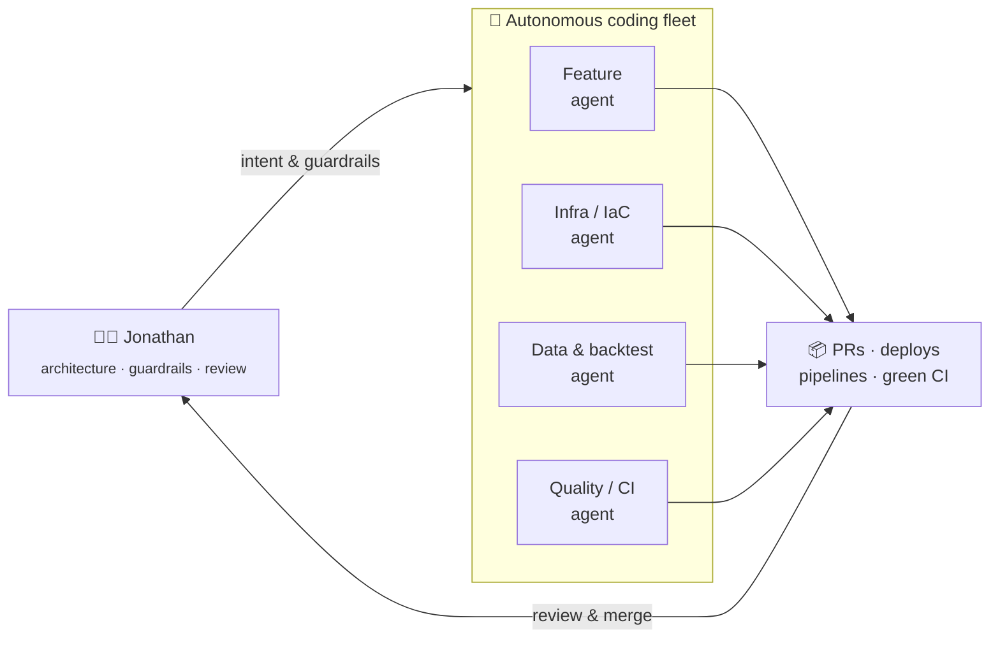

<h1 align="center">Hi, I'm Jonathan Huang 👋</h1>

  <strong>Airline pilot ✈️ &amp; former Sr. Software Engineer — now shipping code with a fleet of AI agents.</strong> 
  機師 × 軟體工程師,現在用一支 AI agent 艦隊把 code 交付出去。

  
  
  
  
  &nbsp;🇹🇼

---

### 🤖 From writing every line to orchestrating agents that do

I've shipped software since 2010. Over the past year my workflow changed shape:
I design the system, set the guardrails, and let **autonomous coding agents** handle
implementation, pull requests, reviews and infra — end to end. My recent commit
history is increasingly **agent-authored, human-reviewed**.

The point isn't fewer engineers — it's a **higher altitude**. I spend my time on
architecture and judgment; the mechanical work is delegated and verified.

---

### 🛠️ Built with

---

### 📌 Selected work

- **[1min-cloudflare-gateway](https://github.com/jonatw/1min-cloudflare-gateway)** — high-performance Cloudflare Workers API gateway
- **[apple-store-scrape](https://github.com/jonatw/apple-store-scrape)** — cross-region Apple price comparison (Python + Workers)
- **[pdf-processor](https://github.com/jonatw/pdf-processor)** — browser-side PDF toolchain (PyMuPDF → WASM)
- **finlab-txd** — quantitative trading research on Taiwan index futures

---

### 📊 GitHub in numbers

  
  

  

